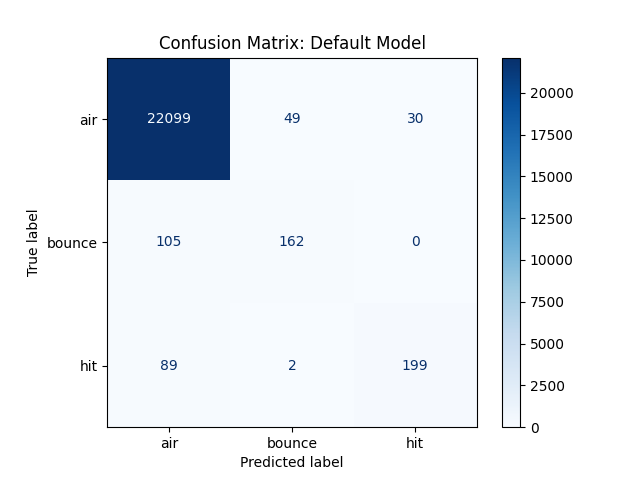
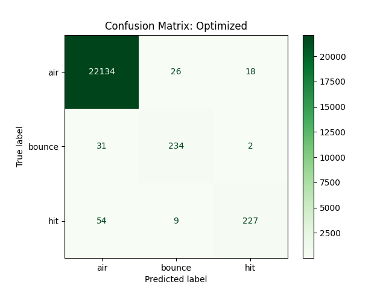
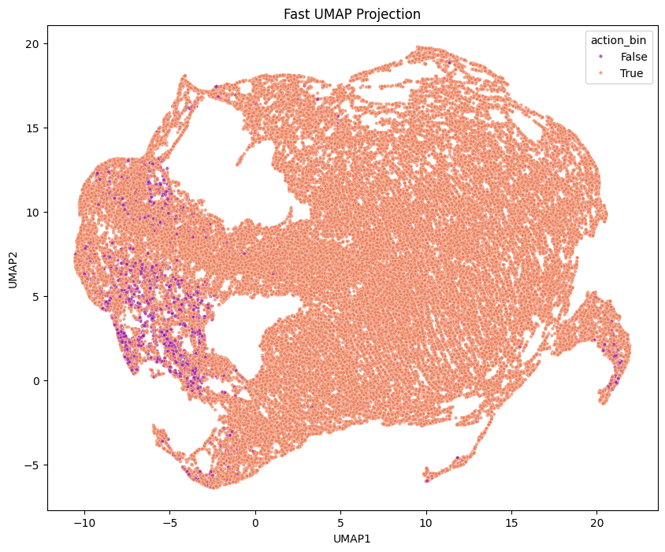
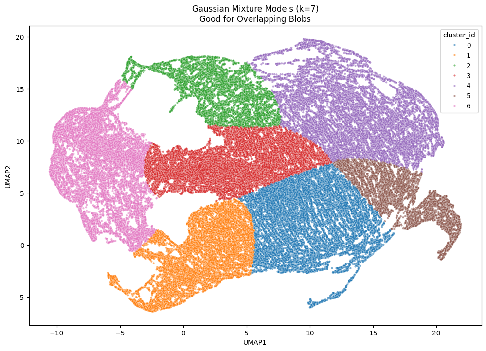
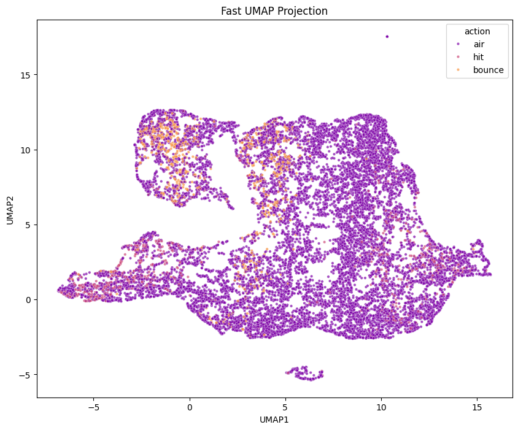
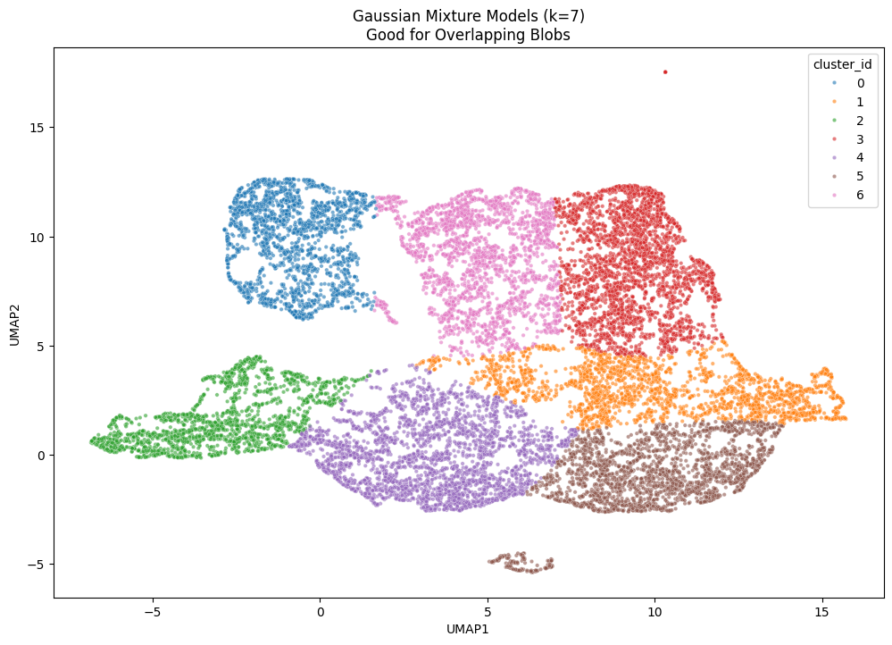

# Tennis Ball Bounce & Hit Detection

Our dataset contains time-series sequences from rallies during the 2025 Roland Garros final. The goal is to develop two ways to predict ball events: a **supervised learning** method and an **unsupervised method**.

---
## Instruction for running the models

##### 1. Installation and Setup

*Install Requirements:* Ensure your Python environment is prepared by installing the necessary dependencies listed in the **requirements.txt** file.

*Environment Configuration:* Update the **.env** file with the paths to your training and test datasets.

*Provide the folder path for the data * Ensure the directory contains JSON files matching the required data format (see the data_example/ folder for a reference template).

🚀 Running Predictions

**Model Access:** The trained models and their specific hyperparameters are located in the models/ directory.

**Execution:** Run the main.py file to generate predictions using the pre-trained models.

**Outputs:** Once the process is complete, all generated results will be stored in the **output/** folder.

## Feature Engineering

This section explains the steps in `preprocess.py` used to find ball events like hits and bounces. The script turns raw (x, y) coordinates into physical and movement-based features. Since the data is organized by rally, we process each rally individually rather than all at once.

### Feature Summary Table

| Category | Key Features | Why we chose this (Simple Explanation) |
| --- | --- | --- |
| **Motion/velocity** | `vx`, `vy`, `speed` | To see where the ball is going and if it suddenly slows down or speeds up. |
| **Forces/acceleration** | `acc_mag`, `jerk_mag` | To catch the "shock" or "jolt" that happens exactly when a racket hits the ball. |
| **Geometry/change of direction** | `cosine_sim`, `turn_angle_deg` | To find sharp corners in the ball's path, which usually mean a bounce or a hit. |
| **Proximity** | `dist_to_event` | To tell how far we are from a detected peak (a sign of a hit/bounce).|
| **Temporal** | `x_lag`, `y_diff`, `y_div` | To give the model a "memory" of what happened just before and after this frame. |

 
<b>Detailed explanation</b>

### 1. Smoothing the Data

Data from video tracking often has "noise" (small errors). We smooth the x and y positions to fix this while keeping the sharp "peaks" that show a hit or bounce.

* **Savitzky-Golay Filter**: This mathematical tool cleans the x and y data to create `x_smooth` and `y_smooth`.
* **Linear Trend Analysis**: We look at small "windows" of time to see the slope of the ball's path, helping us understand the general movement.

### 2. Ball Physics (Kinematics)

Because the ball follows the laws of physics, we calculate how its speed and force change.

* **Velocity (`vx`, `vy`, `speed`)**: Shows how fast the ball is moving and in which direction.
* **Acceleration (`ax`, `ay`, `acc_mag`)**: Helps find moments when a sudden force is applied to the ball.
* **Jerk (`jerk_mag`)**: Measures sudden changes in acceleration; it acts as a "shock detector" for collisions.

### 3. Direction and Shape

The ball often changes direction suddenly when hit. These features find "breaks" in the path to help tell the difference between a bounce on the clay and a racket hit.

* **Cosine Similarity**: Compares the ball's direction before and after a point to find "V-shaped" turns.
* **Turning Angle**: Measures how sharp a turn is in degrees.
* **Speed Delta**: Calculates if the ball gained or lost energy after an impact.

### 4. Peak and Valley Detection

We look at the high and low points of the ball's vertical path:

* **Peak & Valley Detection**: Finds the top of an arc (apex) and the bottom (bounce).
* **Event Merging**: Groups nearby points together so we don't count the same bounce twice due to noise.
* **Distance to Event**: Measures how many frames away the ball is from a peak or valley to help the model focus on impact zones.

### 5. Memory and Symmetry

To give the model "memory," we look at the frames before and after the current moment.

* **Lags & Inverse Lags**: These are positions from past and future frames.
* **Positional Differences**: The actual distance the ball moved over several frames.
* **Asymmetry Ratios (`x_div`, `y_div`)**: Compares forward movement to backward movement; this ratio "spikes" during hits.

---

# 1. Supervised Approach

## Model

To achieve high performance on our tabular trajectory data, we evaluated several gradient-boosted decision tree (GBDT) frameworks known for their efficiency and accuracy: XGBoost, CatBoost, and LightGBM.

While initial baseline results were comparable across all three architectures, we performed an extensive Grid Search optimization on the LightGBM classifier to fine-tune its hyperparameters. This optimization phase proved critical; as demonstrated in the performance comparison below, the tuned LightGBM model shows a considerable improvement in classification accuracy and precision over the initial baseline CatBoost implementation.

Performance Comparison
1. **Baseline Model (CatBoost)**
This initial model provided a solid starting point but struggled with certain edge cases in ball-action detection.

2. **Optimized Model (LightGBM + Grid Search)**
After hyperparameter tuning, the LightGBM model shows significantly better separation between "Hits" and "Bounces," reducing false positives in the "Air" category.

<html>
    

        
        
    

</html>

The primary characteristic of our confusion matrix is the extreme class imbalance, which validates our approach of treating this task as an anomaly detection problem. Because "Air" frames vastly outnumber "Hit" and "Bounce" events, the model must isolate rare signals from a dominant background.

While minor edge cases exist, the supervised model demonstrates a high level of efficacy in distinguishing between a "Hit" and a "Bounce". This represents a critical improvement over the unsupervised approach. In the unsupervised setting, these two events were frequently misclassified because they share nearly identical mathematical signatures; however, supervised learning allows the model to capture the subtle physics-based nuances that differentiate them.

# 2. Unsupervised Approach

Implementing the unsupervised approach presented a significant challenge, as we lacked the luxury of using models that could automatically find hidden links between our target labels and the generated features. This difficulty was compounded by our high number of dimensions (many columns), which caused standard clustering algorithms to struggle.

To solve this, we tested several dimensionality reduction techniques, including PCA, t-SNE, and UMAP, ultimately choosing UMAP for its performance. Through experimentation, we realized that "Hit" and "Bounce" events were essentially anomalies due to the massive class imbalance. Based on this, we structured our unsupervised pipeline into two distinct phases:

## Phase 1: Event Detection
The goal here was to separate "Air" balls from "Other" (potential event) balls.

We applied UMAP using specific columns that exaggerated the physical differences between these states.

Even after embedding, identifying clear clusters remained difficult, so we used a Gaussian Mixture Model (GMM) with 7 components.

We selected the cluster containing the highest concentration of "Other" points to pass into the next stage; all points outside this cluster were classified as "Air".

<html>
    

        
        
    

</html>
## Phase 2: Event Classification
The second phase followed a similar logic but used a different set of columns to differentiate between types of events.

After another UMAP projection and a GMM with 7 components, we assigned labels to each cluster based on their membership.

To handle the remaining "Air" noise, we applied a 10% threshold rule: if a cluster consisted of at least 10% "Hits" or "Bounces," the entire cluster was labeled as that event.

If a cluster met the threshold for both, we assigned the label of the highest representative.

<html>
    

        
        
    

</html>

### Priority logic for assigning cluster labels: 
    if pct_hit > 0.10 and pct_hit > pct_bounce:
        cluster_mapping[cluster_id] = 'hit'
    elif pct_bounce > 0.10:
        cluster_mapping[cluster_id] = 'bounce'
    else:
        cluster_mapping[cluster_id] = 'air'
 
## Inference Pipeline

This entire process was used for training. Once complete, we stored the cluster mappings, the UMAP embeddings, and the GMM models. For testing or new data, the ball coordinates go through this exact same pipeline, and the final prediction is granted based on which cluster the data lands in.

It is clear that you are framing the trajectory of a tennis ball as a time-series problem where events are outliers. Based on your project notes and the code in your files, here is a reformulation of your future ideas for a professional report or README.

### Future Work & Discussion

#### 1. Advanced Anomaly Detection Pipeline

Currently, our model attempts to classify every frame simultaneously. A more robust approach would be to treat the task as a two-stage **Anomaly Detection** problem:

* **Stage 1 (Point Anomaly Detection):** Use time-series algorithms to identify "spikes" or anomalies in the trajectory data, effectively filtering out the "Air" (background) frames.
* **Stage 2 (Event Classification):** Once an anomaly is detected, a secondary classifier determines if that specific point represents a **Hit** or a **Bounce**.

#### 2. Temporal Logic & Rally Pattern Clustering

Since tennis rallies are repetitive, we can improve real-time detection by using the history of the rally to predict the future. We can model the probability of events based on the time elapsed since the last anomaly:

* **Conditional Probability:** If a **Bounce** was detected at time , there is a statistically higher probability that the next anomaly at time  will be a **Hit**.
* **Rally Clustering:** By clustering entire rallies together, we can identify common play patterns, allowing the model to "expect" certain actions based on the style of the rally.

#### 3. Geometric Perspective Correction (3D Depth Mapping)

One limitation of using raw pixel coordinates is that the -pixel is non-linear due to camera perspective; a 10-pixel movement at the top of the frame represents a much larger physical distance than at the bottom. To improve accuracy, we propose converting -pixels into a **Real-World Depth Series ()**:

Using the camera height (), focal length (), and the horizon line (), we can map coordinates to a 3D space:

This would allow the model to calculate actual physical velocity and acceleration, making "Hits" much easier to distinguish from "Air".

#### 4. Unsupervised Feature Engineering & Deep Embeddings

While our current unsupervised approach relies on manual feature engineering, future iterations should explore **Autoencoders** or **Transformers** for generating embeddings.

* **Contextual Information:** Transformers are particularly well-suited for this as they capture information from neighboring points, which is a vital indicator of action type.
* **Two-Stage Unsupervised Logic:** Similar to our supervised idea, the first stage of unsupervised learning should focus on separating "Air" from "Other" through anomaly detection, with specific feature engineering designed to exaggerate those differences before clustering the results in Phase 2.
