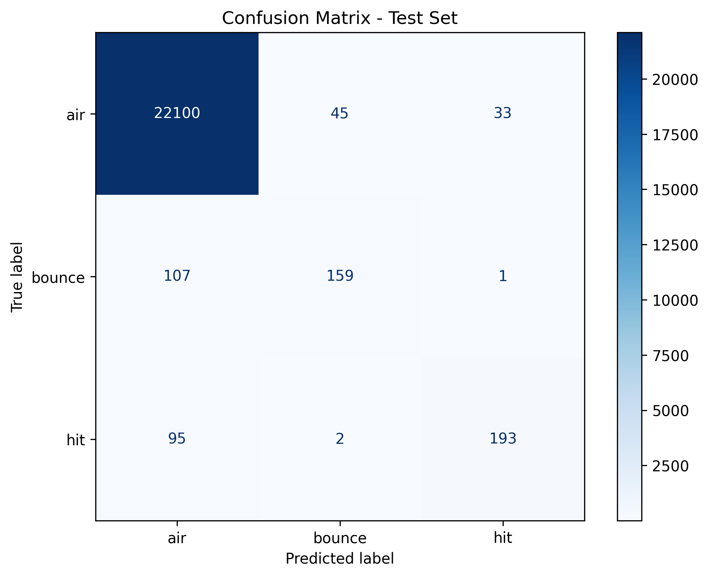

# Tennis Ball Bounce & Hit Detection

Our dataset contains time-series sequences from rallies during the 2025 Roland Garros final. The goal is to develop two ways to predict ball events: a **supervised learning** method and an **unsupervised method**.

---

# 1. Supervised Approach

## Feature Engineering

This section explains the steps in `preprocess.py` used to find ball events like hits and bounces. The script turns raw (x, y) coordinates into physical and movement-based features. Since the data is organized by rally, we process each rally individually rather than all at once.

### Feature Summary Table

| Category | Key Features | Why we chose this (Simple Explanation) |
| --- | --- | --- |
| **Motion/velocity** | `vx`, `vy`, `speed` | To see where the ball is going and if it suddenly slows down or speeds up. |
| **Forces/acceleration** | `acc_mag`, `jerk_mag` | To catch the "shock" or "jolt" that happens exactly when a racket hits the ball. |
| **Geometry/change of direction** | `cosine_sim`, `turn_angle_deg` | To find sharp corners in the ball's path, which usually mean a bounce or a hit. |
| **Proximity** | `dist_to_event` | To tell how far we are from a detected peak (a sign of a hit/bounce).|
| **Temporal** | `x_lag`, `y_diff`, `y_div` | To give the model a "memory" of what happened just before and after this frame. |

 
<b>Detailed explanation</b>

### 1. Smoothing the Data

Data from video tracking often has "noise" (small errors). We smooth the x and y positions to fix this while keeping the sharp "peaks" that show a hit or bounce.

* **Savitzky-Golay Filter**: This mathematical tool cleans the x and y data to create `x_smooth` and `y_smooth`.
* **Linear Trend Analysis**: We look at small "windows" of time to see the slope of the ball's path, helping us understand the general movement.

### 2. Ball Physics (Kinematics)

Because the ball follows the laws of physics, we calculate how its speed and force change.

* **Velocity (`vx`, `vy`, `speed`)**: Shows how fast the ball is moving and in which direction.
* **Acceleration (`ax`, `ay`, `acc_mag`)**: Helps find moments when a sudden force is applied to the ball.
* **Jerk (`jerk_mag`)**: Measures sudden changes in acceleration; it acts as a "shock detector" for collisions.

### 3. Direction and Shape

The ball often changes direction suddenly when hit. These features find "breaks" in the path to help tell the difference between a bounce on the clay and a racket hit.

* **Cosine Similarity**: Compares the ball's direction before and after a point to find "V-shaped" turns.
* **Turning Angle**: Measures how sharp a turn is in degrees.
* **Speed Delta**: Calculates if the ball gained or lost energy after an impact.

### 4. Peak and Valley Detection

We look at the high and low points of the ball's vertical path:

* **Peak & Valley Detection**: Finds the top of an arc (apex) and the bottom (bounce).
* **Event Merging**: Groups nearby points together so we don't count the same bounce twice due to noise.
* **Distance to Event**: Measures how many frames away the ball is from a peak or valley to help the model focus on impact zones.

### 5. Memory and Symmetry

To give the model "memory," we look at the frames before and after the current moment.

* **Lags & Inverse Lags**: These are positions from past and future frames.
* **Positional Differences**: The actual distance the ball moved over several frames.
* **Asymmetry Ratios (`x_div`, `y_div`)**: Compares forward movement to backward movement; this ratio "spikes" during hits.

---

 

## Model

Due to time constraints, we did not test many different models. We focused on models that are successful with tabular data, such as **XGBoost**, **CatBoost**, and **LightGBM**. The results were very similar, so we chose to move forward with the **LightGBM** model.

We performed a grid search to optimize the model, but it did not show a significant improvement.
<html>
    

        
    

</html>

The first thing to notice in our confusion matrix is the class imbalance, which relates directly to our view of this task as an anomaly detection problem.

As shown in the matrix, despite some minor weaknesses, our supervised model is very effective at distinguishing between a hit and a bounce. This is a significant advantage over our unsupervised approach, where the two events were often confused because their mathematical patterns appear very similar.

# Discussions and Improvements

Our project is very similar to an **anomaly detection** model. Since the ball is in flight for most of the rally, a hit or a bounce can be seen as a "spike" or anomaly in the data. A future improvement could involve using **point anomaly detection** on the time series first, and then classifying the type of anomaly (bounce vs. hit) in a second step.

Because tennis rallies are repetitive, it would also be interesting to cluster rallies together to find common patterns. This could lead to models that detect events in real-time by using the history of the current rally:

* If we are at time t and we know that at t - \mu there was a bounce, there is a very high chance that the next detected anomaly will be a hit.

# Ideas 
## 1. The "Ground-Plane" 

TransformThe $y$ pixel in your video is not a linear measure of distance because of perspective. A ball moving 10 pixels at the top of the screen travels much further in real life than a ball moving 10 pixels at the bottom.To fix this, we use the camera height ($H$) and the distance to the baseline ($D_{base}$) to create a Depth Series ($Z$).The Logic:Imagine a triangle where the camera is the top point.The vertical side is Camera Height ($H$).The horizontal side is the Distance along the ground ($Z$).The angle $\theta$ is determined by the $y$-pixel.The Calculation:You can convert every $y$ pixel into a Real-World Distance ($Z$) from the camera using this ratio:$$Z(t) = H \times \frac{f}{y(t) - y_{horizon}}$$(Where $f$ is a constant related to your camera lens and $y_{horizon}$ is the pixel level of the horizon line).

One very good advantage about a ball that is about to bounce it's it get closer to the ground hence 